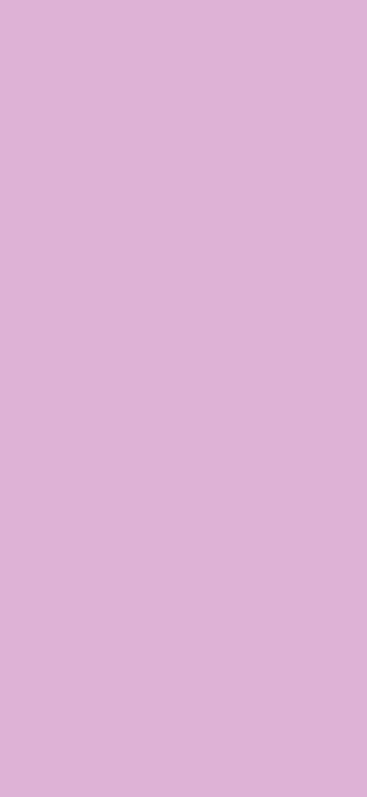
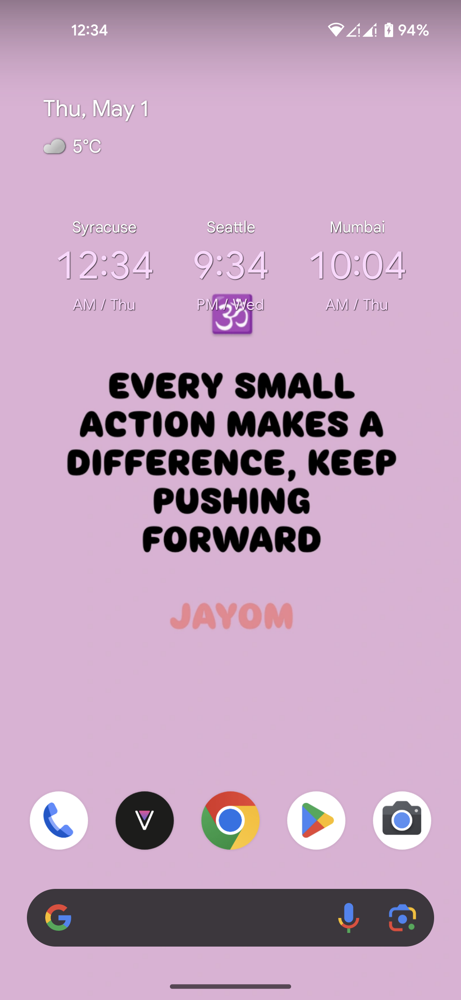

# 🎨 Plain Wallpaper Generator

**Plain Wallpaper Generator** is a simple yet powerful Python-based tool that lets you create **minimalist, high-resolution wallpapers** in **any color** you want, tailored to your phone’s exact screen size.

  
  

## ✨ What It Does

- 🎨 Generates a **plain, solid-colored wallpaper** using any **RGB color**.
- 📱 Saves it at **1080x2340 resolution** – perfect for devices like the **Google Pixel 4a 5G** (easily customizable for others).
- 🖼️ Acts as a **blank canvas** for aesthetic lock screens or social media content.

---

## 🎯 Why This Matters

If you've ever tried creating wallpapers or story backgrounds **directly on Instagram or using online tools**, you’ve likely experienced:

- ❌ **Wrong resolution** for your specific phone.
- ❌ Forced sign-ups on design websites.
- ❌ **Compromised quality** – blurry or poorly cropped results.

This tool **solves all of that** by generating wallpapers that:

- ✅ **Perfectly fit** your device’s screen.
- ✅ Require **no third-party services** or registrations.
- ✅ Offer **full control** over color and resolution.

---

## 📱 How to Use It

1. ⚙️ Run the script and input your desired **RGB color**.
2. 🔁 Transfer the generated image to your smartphone.
3. ✏️ Open **Instagram Stories** (or any editor), and overlay text, quotes, icons, or stickers.
4. 📲 Save and **set it as your wallpaper**, or share it directly!

---

## 💡 Use Cases

- **Instagram Story Templates** – Add quotes or announcements over clean backgrounds.
- **Mood Wallpapers** – Match your background to your vibe or color aesthetic.
- **Branding Visuals** – Keep your content consistent with brand colors.
- **Focus Wallpapers** – Minimal, solid colors to reduce distractions.

---

## 🚀 The Big Idea

This project is a reminder that **a few lines of Python** can be **incredibly powerful** — not just for data or automation, but for everyday **creative expression**.

> **Simple code. Crisp output. Limitless creativity.**

---

## 🖼️ Add Your Image

To include your own generated wallpaper preview in this README:

1. Place your image in the project folder.
2. Update the image link at the top:

